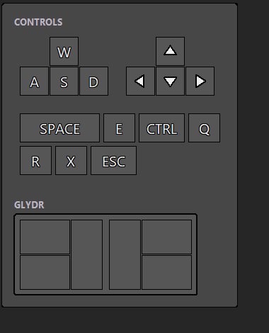
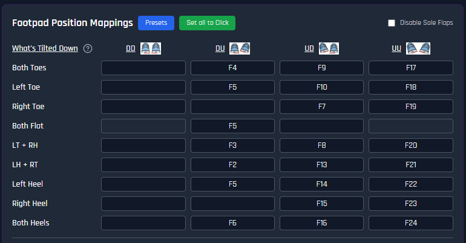

# Denshattack Glydr pedal

Glydr foot pedal HUD + F1-24 remap for Denshattack.



## Prerequisites

Create a Glydr profile to match this. Basically in order to display to a HUD, we listen for F key presses, then trigger a HUD display + key action.



F11 and F12 are unmapped since F11 expands/shrinks window and F12 takes a screenshot natively.

### You will also need

Windows: Python 3.8+

Mac: Python 3.8+, `pip install pynput`

Linux: Python 3.8+, `pip install pynput`, `sudo apt install python3-tk`

More detail: [Setup](#setup).

## Get the files

Green **Code** button up top, **Download ZIP**, then unzip it.

Or clone:

```
git clone https://github.com/rokubop/glydr-denshattack-hud.git
```

Anywhere is fine. Nothing gets installed, the script runs from wherever you
put it.

## How to launch

Run this script. It should show the HUD + now bind F1-F24 to chosen keys.

```
python denshattack_hud.py
```

Quit: `Ctrl+C` or `CTRL + SHIFT + Q`, in the console.
It is click-through on Windows, so there is nothing to click.

## Config

You can change some settings in [denshattack_hud.py](./denshattack_hud.py)

| setting | default | |
|---|---|---|
| `MONITOR_INDEX` | `0` | 0 = primary |
| `ANCHOR` | `right_middle` | which edge to stick to |
| `OFFSET_X` | `16` | inset from that edge |
| `OFFSET_Y` | `0` | nudge down, negative for up |
| `OPACITY` | `0.92` | whole window |
| `CLICK_THROUGH` | `True` | Windows only |
| `EMIT_KEYS` | `True` | send keys to the game, see below |
| `FONT_CANDIDATES` | Segoe UI, ... | first one installed wins |

`ANCHOR` is `horizontal_vertical`.
Horizontal: `left` `center` `right`. Vertical: `top` `middle` `bottom`.
So `left_top`, `center_middle`, `right_bottom`, and so on.

## Pedal map

`PEDAL_MAP` near the top, a one for one copy of the profile above.
F-key to (keys it outputs, sections it lights).

```python
"f5":  (["space"],         ["left_flap"]),
"f17": (["d", "w"],        ["left_toe", "right_toe"]),
```

Section names: `left_toe` `left_heel` `left_flap` `right_toe` `right_heel` `right_flap`.

Edit this to match your own pedal or game.

F5 covers three positions: left toe, flat, left heel. The HUD lights only the
flap for it. One F-key cannot tell them apart.

## Key output

On by default. Pedal presses go to the focused window as real key presses.

Held, not tapped. Press the pedal, the key goes down and stays down. Release
it and the key comes up. Quitting releases anything still held.

Windows uses scancode injection, which DirectInput games accept.

Set `EMIT_KEYS = False` for a draw-only overlay. Worth doing if something
else is already mapping these F-keys, otherwise the game sees each press
twice.

## Setup

### Python

Check with:

```
python --version
```

No output or "not recognized" means it is missing. On macOS and Linux try
`python3` before assuming.

| | get it |
|---|---|
| Windows | python.org/downloads, tick **Add python.exe to PATH** during install |
| macOS | python.org/downloads |
| Linux | `sudo apt install python3 python3-tk` |

### tkinter

What draws the HUD. Bundled with Windows and the python.org installers, so
most people already have it. Not bundled with Homebrew python or most Linux
distros.

```
python -m tkinter
```

A small demo window opens if it works. If it errors instead:

| | fix |
|---|---|
| Homebrew python | `brew install python-tk` |
| Debian, Ubuntu | `sudo apt install python3-tk` |
| Fedora | `sudo dnf install python3-tkinter` |

### pynput

Reads the pedal. Not needed on Windows.

| | |
|---|---|
| Windows | nothing, talks to the OS directly |
| macOS | `pip install pynput` |
| Linux (X11) | `pip install pynput` |

macOS also needs Accessibility permission for whatever runs Python:
`System Settings > Privacy & Security > Accessibility`
Without it the HUD draws but never lights up.

## Limits

| | Windows | macOS | Linux (X11) |
|---|---|---|---|
| dependencies | none | pynput | pynput |
| click-through | yes | no | no |
| `MONITOR_INDEX` | yes | needs `screeninfo` | needs `screeninfo` |

No click-through on macOS or Linux: the panel catches mouse clicks. Keep it out of the way.

`F21`-`F24` do not register on macOS or Linux. pynput only exposes `f1`-`f20` there.
Four pedal combos live in that range. Remap them lower in the Glydr config if you need them.
Not to F11 or F12 though, see above.

Wayland blocks global key capture entirely. Use an X11 session.
Compositor policy, nothing the script can do.
